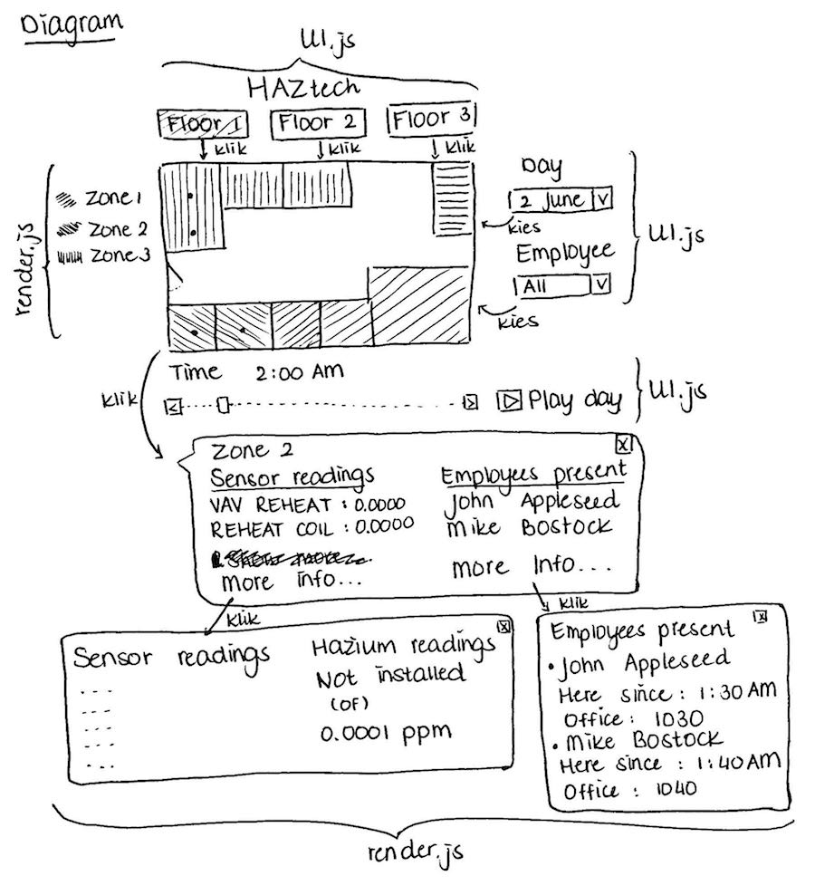

# Design document
## Gedetailleerde schets
Hieronder volgt een gedetailleerde schets van mijn visie voor het eindproduct. Het laat zien welke onderdelen met elkaar verbonden zijn en hoe. Het probeert ook te laten zien welke modules en klassen gebruikt worden om de visualisatie te maken en fucntionaliteit te geven. Welke code verantwoordelijk is voor welk onderdeel van de visualisatie wordt ook aangegeven. De code voor de visualisatie wordt namelijk opgesplitst in meerdere files om gerelateerde code bij elkaar te houden maar los te maken van andere onderdelen.  
  
### UI.js
UI.js zal alle componenten bevatten rondom de user interface, zoals de knoppen en dropdowns. Door het UI werk te beperken in een file, is in een keer duidelijk wat elk element in de code doet. UI.js zal zelf geen code bevatten die de kaart doet veranderen of de stipjes laat bewegen etc. Het bevat voornamelijk event listeners voor de UI elementen zoals de knoppen en dropdowns. De event listeners hebben als callback functies die in bijvoorbeeld render.js staan zodat de kaart van verdieping verandert of dat er alleen stipjes van bepaalde werknemers op de kaart komen te staan.
### render.js
Render.js bevat de code om de kaarten en popups te laten zien of te updaten. Het zal bijvoorbeeld functies bevatten die UI.js zal aanroepen als de user interact met een UI element. De kaart zal bijvoorbeeld updaten of er wordt gefocust op een enkele werknemer. Er zullen functies in zitten die de HTML canvas bewerken zodat er andere floorplans tevoorschijn komen.
### Eventuele uitbreidingen
Het is eventueel mogelijk om de functionaliteit voor de popups uit render.js te halen en zijn eigen module te geven, bijvoorbeeld popups.js. Dit zou kunnen omdat de popups eigenlijk niet gerenderd worden dus zou het logisch zijn om deze hun eigen module te geven. Daarnaast kan het ophalen en opzoeken van de data een aparte module krijgen om het opzoeken te beperken tot een eigen file. Het afspelen van een gehele dag zal waarschijnlijk ook zijn eigen module krijgen, zodat de stipjes door het gebouw bewegen. Dit kan ook functies uit bijvoorbeeld render.js aanroepen voor de visuele elementen.
## Libraries
Voor de visualisatie wordt D3js gebruikt. Andere libraries zouden ook gebruikt kunnen worden, maar daarvoor moet eerst gekeken worden naar welke functionaliteit er nog mist en of het niet efficienter is om het zelf te implementeren. Dan zouden libraries, die bewerkingen op arrays of objecten kunnen doen, van pas kunnen komen. jQuery kan handig zijn voor bijvoorbeeld GET requests of voor efficientere DOM manipulatie.
## Lijst van databronnen
De data is fictief en komt van de website van de VACommunity op http://vacommunity.org/2016+VAST+Challenge%3A+MC2 (e-mail vereist).
## Dataverwerking
De data staat voor een groot deel al in een werkbaar format. De sensormetingen zijn in csv of json format, waar D3 mee overweg kan. De lijst van werknemers is in xlsx format, dus zou eerst omgezet moeten worden naar csv of json voordat D3 het kan inladen. Als dat geregeld is, dan staat alles in een goed werkbaar en leesbaar format. Een ander probleem is hoe de data wordt opgeslagen. Lokaal opslaan vereist het lezen van alle data om de visualisatie te renderen. Een idee is om de data online te hosten. Dan kan er met queries de data worden opgevraagd en hoeven niet alle bestanden meteen ingelezen te worden. Een ander idee is om SQL te gebruiken als een database voor de data, dan kan er ook met queries data worden opgevraagd.
## Skeleton
