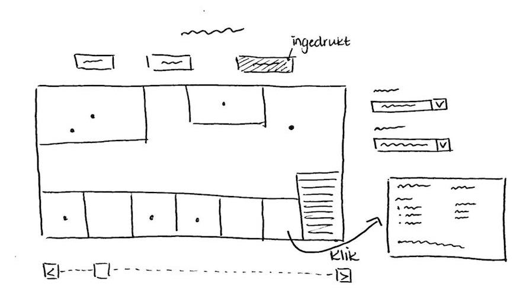
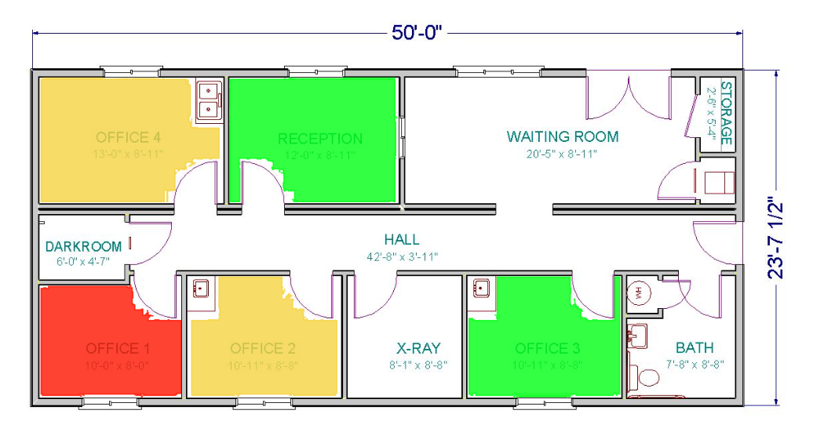
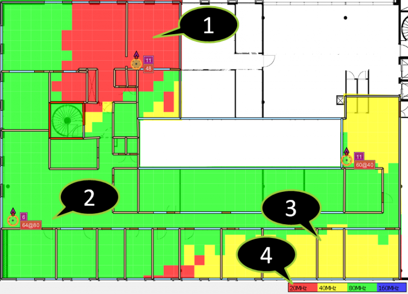

# Programmeerproject - HAZtech
## Mini Challenge 2 van VACommunity
### 1. Achtergrond
GASTech is verhuisd naar een nieuw gebouw, maar er moeten nog wat HVAC issues verholpen worden. Het gebouw laat concentraties Hazium zien, die waarschijnlijk gevaarlijk zijn voor mensen. Daarom moeten er sensoren komen die de concentratie Hazium kunnen meten, maar deze sensoren zijn nieuw en dus duur. Om bij te houden wanneer werknemers zich in zones bevinden die mogelijk gevaarlijk zijn, moet elke werknemer een prox card bij zich dragen. Een prox card reader leest deze kaart, mits de werknemer die bij zich draagt, en houdt bij wanneer een werknemer zich waar bevindt, maar ze hebben deze kaart niet altijd bij zich. Sommige werknemers zullen hun prox card ophalen bij de security desk, mochten ze deze vergeten zijn. Daarnaast heeft het bedrijf ook de beschikking tot een mobiele prox sensor in de vorm van een mobiele robot, Rosie. Zij kan de prox cards lezen in ruimtes waar zij doorheen reist.

### 2. Project proposal
#### 2.1 Doel
Het doel van deze visualisatie is om patronen van het bedrijf GAStech te onderzoeken met behulp van een visualisatie van waar elke werknemer zich op bepaalde tijden bevindt. Zo kan bepaald worden of het gedrag van werknemers in het bedrijf roekeloos of gevaarlijk is voor hun gezondheid en kunnen relaties tussen prox card data en de building plans onderzocht worden.
#### 2.2 Features
Er kan een dag gekozen worden om de data voor te laten visualiseren. Er wordt dan een kaart of tabel ingevuld met de prox card data en HVAC sensor readings voor het hele gebouw, maar er kan met bijvoorbeeld een dropdown gekozen worden voor een specifieke verdieping. Patronen worden los van de visualisatie beschreven in bijvoorbeeld een paragraph element, omdat deze over de hele periode gelden.
#### 2.3 Schets
Het hoofdelement van de visualisatie is een kaart van het gebouw. De kaart laat steeds een verdieping per keer zien, maar er kan geswitcht worden met knoppen, zodat alle verdiepingen bekeken kunnen worden. In eerste instantie zijn er stipjes te zien van alle werknemers, maar er kan met een menu gefocust worden op een enkele werknemer om zijn/haar bewegingen te volgen. Verder is er een dropdown om specifieke dagen te selecteren en een slider om door de dag heen te lopen. Door op een ruimte in een kaart te klikken, wordt er meer info geshowd, o.a. welke werknemers zich daar op dat moment bevinden, de metingen van de sensoren en in welke zone de ruimte behoort. Onder de kaart is ruimte bestemd voor het beschrijven en uitleggen van de patronen van de werknemers bij GAStech en het aan het licht brengen van gevaarlijke praktijken.

#### 2.4 Data
De data, die in deze visualisatie gebruikt wordt, is fictief, en is beschikbaar gesteld door de VACommunity (zie Bronnen - Data). De floorplans zijn in .jpg format, en kunnen bijvoorbeeld op een HTML canvas getekend worden en is er dan minimale bewerking nodig: hoogstens wat gecrop. De data die gevisualiseerd wordt op de kaart is verkrijgbaar in .csv of .json format. Er hoeft dus niks omgezet te worden om de data bruikbaar te maken. Er kan met beide formats gewerkt worden: ze bevatten dezelfde data. De lijst van werknemers is in .xlsx format. Het is misschien handig om deze ook om te zetten naar .csv of .json voor consistentie of makkelijker werken.
#### 2.5 Visualisatielinks
Er zijn veel interactieve elementen maar uiteindelijk veranderen ze welke data er op de kaart te zien is, met uitzondering van de popup-box als er een ruimte aangeklikt wordt. De knoppen bovenaan bieden de mogelijkheid om de verdieping te veranderen, wat de kaart aanpast. De eerste dropdown rechts van de kaart kan gebruikt worden om op een enkele werknemer te focusen, zodat alleen het stipje van die werknemer op de kaart verschijnt. Met de tweede dropdown kan de dag gekozen worden om te visualiseren. De slider onder de kaart werkt als een soort klok, waarmee een specifieke tijden van de dag kunnen worden gekozen. Er is eventueel een afspeelknop, waarmee de dag in zijn geheel wordt afgespeeld. Als er op een ruimte wordt geklikt, verschijnt er een infowindow rechts van de kaart, onder de dropdowns. Hier is meer informatie te vinden over de ruimte die is aangeklikt. Dit is het enige visualisatie-element dat de kaart niet doet veranderen.
#### 2.6 Externe componenten
Externe componenten in dit project zijn de data (zie 2.4 Data) en de Javascript library D3js (zie Bronnen - D3js). Om de floorplans te tekenen kan gebruikgemaakt worden van een HTML canvas en om er extra elementen op te tekenen, zoals de stipjes, kan gebruikgemaakt worden van D3 en zijn transitions. Verder kunnen events met D3 gebonden worden aan interactieve elementen zoals de dropdowns en sliders zodat de visualisatie snel aangepast kan worden.
#### 2.7 Problemen en limitaties
Tijdens het project kunnen enkele kleine problemen opdoen. Het is wenselijk om de grote hoeveelheid data snel in te laden. Het lokaal laden van data kan op den duur veel tijd kosten als de visualisatie steeds opnieuw geladen moet worden. Het is daarom misschien handig om de data online te hosten. Verder is het misschien een probleem dat de coordinaten in de data niet overeenkomen met de coordinaten op de kaart. Daar moet dan een converterfunctie voor geschreven worden.
#### 2.8 Soortgelijke visualisaties
Working with Synoptic Panel in PowerBI: https://blogs.technet.microsoft.com/powerbivisualisation/2016/03/01/synopticpanelcustomvisualisation/
Deze visualisatie is een floorplan met een heatmap, die laat zien hoeveel de werkelijke temperatuur in een ruimte verschilt van de doeltemperatuur. Het lijkt op de doelvisualisatie in dit project, alleen laat het slechts een verdieping van het gebouw zien en laat het niet zien in welke ruimtes de bewoners zich bevinden op een gegeven moment van de dag. Het gebruikt wel een heatmap, die misschien in dit project ook gebruikt kan worden om de concentratie Hazium aan te geven per ruimte.

Ekahau Site Survey Heatmap Visualizations - Channel Bandwidth: http://www.ekahau.com/wifidesign/blog/tag/wifi-site-survey/
Deze visualisatie is eveneens een floorplan met een heatmap, maar hier laat de heatmap de bandbreedtes van een wifisignaal zien. Hij wordt gebruikt om in kaart te brengen in welke ruimtes van het huis het wikisignaal zwak is en mogelijk versterking nodig heeft.

### 3. Minimum viable product (MVP)
Het minimum viable product in dit project laat de floorplans zien voor het GAStech gebouw en bevat de HVAC metingen en posities van de werknemers. Op deze manier kan het bedrijf analyseren wie er gevaarlijk bezig is en op welke plekken en tijden de Hazium concentraties gevaarlijk zijn. Het uiteindelijke doel is om een product of tool aan het bedrijf te leveren waarmee het bedrijf werknemers op de vingers kan tikken voor gevaarlijk gedrag. Het kunnen focusen op een enkele werknemer kan worden gezien als optionele implementatie, maar het maakt het wel makkelijker om gedrag te volgen als er slechts een enkel stipje op de kaart is.

### Bronnen
Data en probleemstelling: http://vacommunity.org/2016+VAST+Challenge%3A+MC2
D3js: https://d3js.org
